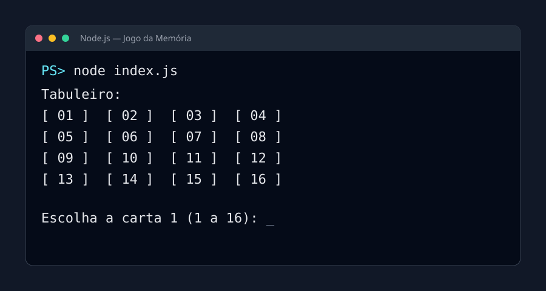
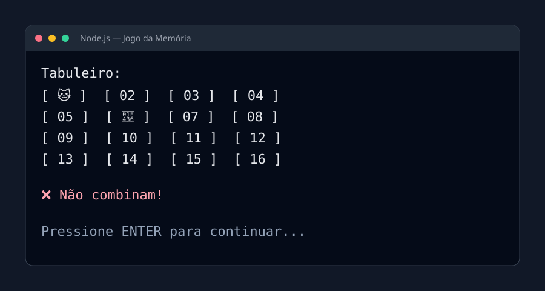
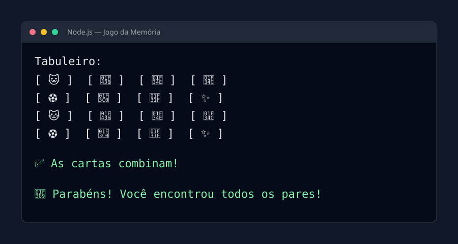
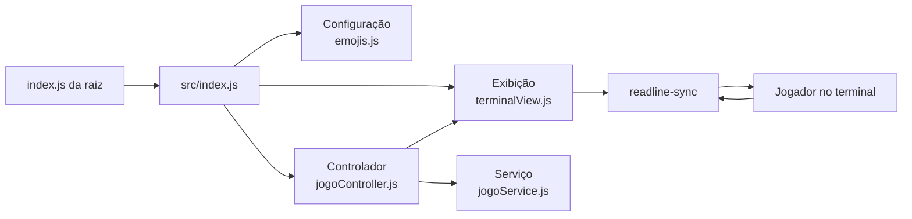
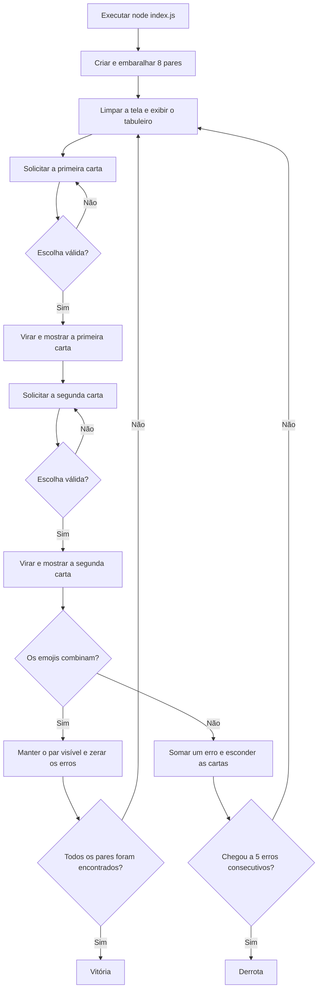

# Jogo da Memória no Terminal

Jogo da memória desenvolvido em JavaScript para Node.js. A aplicação roda
inteiramente no terminal, possui 16 cartas — oito pares de emojis — e foi
organizada em camadas para separar as regras, o fluxo e a apresentação.

## Funcionalidades

- Tabuleiro 4 × 4 com cartas numeradas de 01 a 16.
- Oito pares de emojis embaralhados a cada nova partida.
- Escolha das cartas pelo teclado com `readline-sync`.
- Validação de números inexistentes, cartas repetidas e pares já encontrados.
- Pares corretos permanecem visíveis no tabuleiro.
- Um acerto zera a quantidade de erros consecutivos.
- Vitória depois de encontrar todos os pares.
- Derrota depois de cinco erros consecutivos.
- Limpeza e reconstrução do tabuleiro após cada escolha e rodada.

## Tecnologias utilizadas

- JavaScript
- Node.js 18 ou mais recente
- readline-sync
- Test Runner nativo do Node.js

## Como instalar

Abra o terminal na pasta do projeto e instale a dependência:

```bash
npm install
```

## Como iniciar

Execute diretamente o arquivo `index.js` da raiz:

```bash
node index.js
```

O comando abaixo também funciona porque o script `start` do `package.json`
aponta para o mesmo arquivo:

```bash
npm start
```

Digite o número de uma carta por vez. Depois de observar as duas cartas,
pressione **ENTER** para seguir para a próxima rodada.

## Telas do jogo funcionando

### Início da partida

Todas as cartas começam viradas para baixo e mostram apenas seu identificador.



### Duas cartas diferentes

As cartas selecionadas ficam visíveis durante a comparação e o erro é informado.



### Final da partida

Quando todos os pares são encontrados, o tabuleiro completo e a mensagem de
vitória são apresentados.



## Organização do projeto

```text
JogoDaMemoria/
├── index.js                       # Ponto de entrada: node index.js
├── package.json                   # Dependências e comandos npm
├── src/
│   ├── index.js                   # Conecta as camadas da aplicação
│   ├── config/
│   │   └── emojis.js              # Lista dos oito emojis
│   ├── controllers/
│   │   └── jogoController.js      # Coordena escolhas e rodadas
│   ├── services/
│   │   └── jogoService.js         # Estado e regras do jogo
│   └── views/
│       └── terminalView.js        # Entrada e saída do terminal
└── test/
    ├── jogoController.test.js     # Testa uma partida completa
    └── jogoService.test.js        # Testa cada regra isoladamente
```

## Diagrama das camadas



### Responsabilidade de cada camada

| Camada | Arquivo | Responsabilidade |
|---|---|---|
| Configuração | `src/config/emojis.js` | Guarda os oito emojis usados nas cartas. |
| Serviço | `src/services/jogoService.js` | Cria e embaralha o baralho, valida escolhas, compara pares e verifica vitória ou derrota. |
| Exibição | `src/views/terminalView.js` | Limpa a tela, desenha o tabuleiro, mostra mensagens e lê o teclado. |
| Controlador | `src/controllers/jogoController.js` | Solicita escolhas e coordena a comunicação entre serviço e exibição. |
| Entrada | `index.js` e `src/index.js` | Carrega as dependências e inicia a partida. |

## Fluxo de uma partida



## De onde cada arquivo é importado

- `require("./src/index")` começa na raiz e entra na pasta `src`.
- `require("./config/emojis")` busca `emojis.js` a partir de `src/index.js`.
- `require("../services/jogoService")` volta da pasta `controllers` para `src`
  e depois entra em `services`.
- `require("readline-sync")` não utiliza `./` porque procura uma dependência
  instalada pelo npm dentro de `node_modules`.
- `module.exports` define quais funções ou valores poderão ser importados por
  outros arquivos.

## Como executar os testes

```bash
npm test
```

Os testes verificam a criação das 16 cartas, formação e ocultação de pares,
contagem de erros, validação das escolhas, condição de derrota e uma partida
completa até a vitória.
